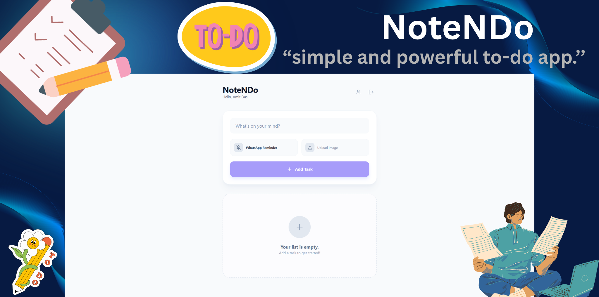

<p align="center">
  
</p>

<p align="center">
  <b>Smart To-Do & Reminder App with WhatsApp Alerts ⚡</b>
</p>

<h1 align="center">NoteNDo — Smart Task Manager</h1>

<p align="center">
  <b>Simple • Fast • Reliable 🚀</b><br>
  Developed by <a href="https://www.amitdas.site/">Amit Das</a>
</p>

---

## 🚀 Overview

**NoteNDo** is a modern full-stack to-do application that helps you manage tasks, organize notes, and receive smart reminders directly on WhatsApp.

It combines real-time cloud syncing with an automated reminder system, ensuring you never miss important tasks. Designed for simplicity and performance, NoteNDo is perfect for daily productivity.

---

## ⚡ Quick Start

```bash
# Clone the repository
git clone https://github.com/AmitDas4321/NoteNDo.git
cd NoteNDo

# Install dependencies
npm install

# Start development server
npm run dev
````

Open:

```
http://localhost:3000
```

---

## 📸 Preview

<p align="center">
  
</p>

---

## ⚡ Core Features

* Task & To-Do Management
* Smart Reminder System
* WhatsApp Notifications
* Firebase Realtime Sync
* User Profile Management
* Media Attachment Support
* Timezone-aware Scheduling
* Fully Responsive UI

---

## 🧠 How It Works

1. Create a task
2. Set reminder date & time
3. Data stored in Firebase
4. Background service checks reminders
5. WhatsApp notification sent
6. Task marked as notified

---

## 🖥️ Dashboard Sections

### Tasks

* Create, edit, delete tasks
* Mark as completed
* Add descriptions and media

### Reminders

* Set date & time
* Enable or disable reminders
* WhatsApp alerts

### Profile

* Manage user information
* Set timezone

---

## 📊 Live Features

* Real-time updates
* Reminder tracking
* Task status (pending / completed)
* Notification logs

---

## 🌐 API Endpoints

| Endpoint                   | Description   |
| -------------------------- | ------------- |
| `/api/db/todos`            | Get tasks     |
| `/api/db/todos` (POST)     | Create task   |
| `/api/db/todos/:id`        | Update task   |
| `/api/db/todos/:id` DELETE | Delete task   |
| `/api/db/users/:uid`       | Get user      |
| `/api/db/users/:uid`       | Update user   |
| `/api/whatsapp/send`       | Send WhatsApp |
| `/api/upload`              | Upload files  |

---

## ⚙️ Background System

* Runs every minute
* Checks reminder time
* Sends WhatsApp alerts
* Marks reminders as sent

---

## 📦 Tech Stack

* React
* Tailwind CSS
* Vite
* Node.js + Express
* Firebase Realtime Database
* TextSnap API
* Multer

---

## 🤝 Credits & Services

### TextSnap (WhatsApp API)

This project is supported by TextSnap, which provides the WhatsApp messaging system used for sending real-time reminders.

How to get access:

1. Visit [https://textsnap.in](https://textsnap.in)
2. Create an account
3. Create a new instance
4. Connect your WhatsApp using QR code
5. Obtain your Instance ID and Access Token

Used for:

* Sending WhatsApp reminders
* Media message delivery
* Notification system

---

### Firebase Realtime Database

Firebase is used as the backend database for storing tasks and user data.

How to get started:

1. Visit [https://console.firebase.google.com](https://console.firebase.google.com)
2. Create a new project
3. Go to Build → Realtime Database
4. Create a database (use test mode for development)

Used for:

* Task storage
* User data management
* Real-time synchronization

---

## 📁 Project Structure

```
NoteNDo
├── assets/
├── src/
├── server.ts
├── index.html
├── package.json
├── tsconfig.json
├── vite.config.ts
├── Dockerfile
├── metadata.json
├── .env.example
├── .gitignore
├── README.md
├── SPONSORS.md
```

---

# 🚀 Deployment Guide

---

## 🌐 Deploy on Render

1. Push to GitHub
2. Go to Render dashboard
3. Create a new Web Service
4. Connect your repository

### Build and Start

```
npm install && npm run build
npm start
```

---

### Environment Variables

```
# ===============================================
# NOTE N DO - ENVIRONMENT CONFIGURATION
# Version: 1.0.0
# Author: Amit Das
# ===============================================

# APPLICATION URL
# The public URL where this application is hosted.
# Used for API callbacks, redirects, and internal references.
APP_URL=https://example.com


# TEXTSNAP API CONFIGURATION
# Credentials required for sending WhatsApp messages via TextSnap API.
TEXTSNAP_INSTANCE_ID=
TEXTSNAP_ACCESS_TOKEN=


# FIREBASE REALTIME DATABASE CONFIGURATION
# Base URL of your Firebase Realtime Database.
FIREBASE_DATABASE_URL=

# Secret key used for authenticating requests to Firebase.
FIREBASE_DATABASE_SECRET=
```

---

### Notes

* Use dynamic port:

```js
const PORT = process.env.PORT || 3000;
```

* Do not upload `.env` file
* Free tier may sleep, affecting reminders

---

## 🖥️ Deploy on VPS (Ubuntu)

### Setup

```bash
git clone https://github.com/yourusername/NoteNDo.git
cd NoteNDo
npm install
npm run build
```

---

### Run with PM2

```bash
npm install -g pm2
pm2 start server.ts --name notendo --interpreter tsx
pm2 save
pm2 startup
```

---

## 🌍 Nginx (Custom Domain)

```nginx
server {
    server_name yourdomain.com;

    location / {
        proxy_pass http://localhost:3000;
        proxy_set_header Host $host;
    }
}
```

---

## 🐳 Docker (Optional)

```bash
docker build -t notendo .
docker run -p 3000:3000 --env-file .env notendo
```

---

## ⚠️ Production Tips

* Use VPS for 24/7 reminders
* Secure environment variables
* Use HTTPS
* Monitor with PM2

---

## 📬 Support

<p align="center">
  <a href="https://t.me/BlueOrbitDevs">
    
  </a>
</p>

---

## 📜 License

MIT License © 2026 Amit Das

---

<p align="center">
  <b>Built with React and Express</b><br>
  Made by <a href="https://amitdas.site">Amit Das</a>
</p>